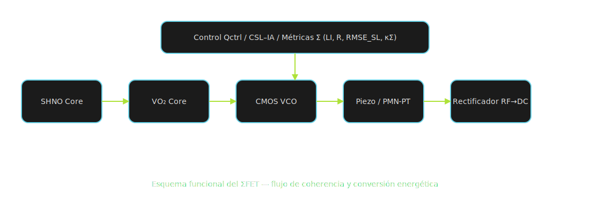

# ⚙️ ΣFET — Bill of Materials (BOM) · TCDS_Gradiente_Económico

Este módulo reúne los **listados completos de materiales (BOM)** para el sistema **ΣFET — Synchrotron Field-Effect Transistor**,  
componente experimental de la **Teoría Cromodinámica Sincrónica (TCDS)** dentro del proyecto *Gradiente Económico*.

Cada archivo CSV corresponde a una subarquitectura física reproducible y auditable del conjunto ΣFET.

---

## 📘 Descripción general

El **ΣFET** (Sigma Field-Effect Transistor) implementa la transferencia coherencial entre campos Q–Σ–φ–χ,  
operando como interfaz experimental entre el hardware sincrónico y las métricas Σ-metrics.  
Su propósito es validar los umbrales **LI ≥ 0.90**, **R > 0.95**, **RMSE_SL < 0.10**, **Reproducibilidad ≥ 95 %**  
mediante estructuras reproducibles en laboratorio y un marco económico auditable.

---

## 📂 Archivos incluidos

| Archivo | Descripción | Tipo |
|----------|-------------|------|
| [bom_shno_sigmafet.csv](bom_shno_sigmafet.csv){:target="_blank"} | Núcleo SHNO (Spin Hall Nano-Oscillator, 5–20 GHz). | Oscilador base |
| [bom_vo2_sigmafet.csv](bom_vo2_sigmafet.csv){:target="_blank"} | Núcleo VO₂ Mott, fase de transición térmica y locking subarmónico. | Oscilador térmico |
| [bom_cmos_sigmafet.csv](bom_cmos_sigmafet.csv){:target="_blank"} | Núcleo CMOS VCO / PLL (1–3 GHz). | Electrónica de control |
| [bom_piezo_ring_transducer.csv](bom_piezo_ring_transducer.csv){:target="_blank"} | Transductor piezoeléctrico PMN-PT [001], acoplamiento mecánico. | Convertidor piezo |
| [bom_rectifier_rf_dc.csv](bom_rectifier_rf_dc.csv){:target="_blank"} | Rectificador RF→DC con diodo Schottky SMS7630. | Captura energética |
| [bom_lab_infrastructure.csv](bom_lab_infrastructure.csv){:target="_blank"} | Elementos comunes de laboratorio (cables, ferritas, tierra única). | Infraestructura |

> Cada archivo incluye: ItemNo, Part, Description, Manufacturer, MPN, Qty, Unit, UnitCostUSD, ExtendedCostUSD, Supplier, Notes y alternativas.

---

## 🧩 Integración con TCDS_Gradiente_Económico

Este paquete pertenece al **eje experimental y de hardware** del proyecto,  
vinculado a los módulos de validación económica (`ledger.json`, `prices.yaml`)  
y a la infraestructura de reproducibilidad definida en el **TCDS Business Plan**.

Para trazabilidad completa, se recomienda citar el DOI general del proyecto TCDS-Σ  
y, al publicar este módulo en Zenodo, asignarle un DOI individual secundario.

---

## 🔖 DOI sugerido para esta publicación

> Carrasco Ozuna, G. (2025). *ΣFET — Bill of Materials (BOM) · TCDS_Gradiente_Económico*.  
> Zenodo. DOI: 10.5281/zenodo.xxxxxxxx  

*(reemplazar con el DOI real al subir el ZIP a Zenodo)*

---

## 🧠 Cita relacionada
Carrasco Ozuna, G. (2025). *TCDS-Σ — Plan de Negocios y Dossier (Canon Económico y Científico 2025–2030).*  
Zenodo. [https://doi.org/10.5281/zenodo.17494368](https://doi.org/10.5281/zenodo.17494368)

---

## 🧮 Especificaciones técnicas
- Formato: CSV UTF-8, delimitado por comas, con encabezado estándar.  
- Costo: precios de referencia USD 2025, sin impuestos.  
- Compatibilidad: Microsoft Excel, LibreOffice Calc, Python (pandas).  
- Extensibilidad: se admiten columnas adicionales (`Source`, `Batch`, `ReproID`) para trazabilidad interna.

---

## 📜 Licencias
- **Ciencia y documentación:** CC BY-NC-SA 4.0  
- **Aplicaciones derivadas y hardware:** TCDS Σ Open Lab License v1.1  
- **Autor:** Genaro Carrasco Ozuna · ORCID [0009-0005-6358-9910](https://orcid.org/0009-0005-6358-9910)

---

## 🔗 Navegación cruzada

- [🔹 Proyecto TCDS_Gradiente_Económico](https://geozunac3536-jpg.github.io/TCDS_Gradiente_Economico/){:target="_blank"}  
- [🔹 Dossier TCDS-Σ — Business Plan](https://geozunac3536-jpg.github.io/TCDS-Business-Plan/){:target="_blank"}  
- [🔹 Repositorio Central TCDS Portal](https://geozunac3536-jpg.github.io/TCDS-PORTAL/){:target="_blank"}

---

© 2025 Genaro Carrasco Ozuna — Proyecto TCDS-Σ  
Licencia dual (CC BY-NC-SA 4.0 / TCDS Σ Open Lab License v1.1)
